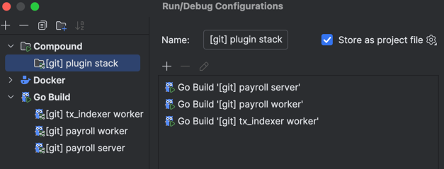

# Vultisig Plugin-Verifier-Markeplace

1. Front-end applications that can't integrate with [mobile-tss-lib](https://github.com/vultisig/mobile-tss-lib) will use VultiServer as a TSS server.
2. Fast Vault: Allows creating a 2/2 vault with one mobile device, with VultiServer as the second party. Users can sign transactions with one device.
3. Fast Vault with 2/3: Allows creating a 2/3 vault with two mobile devices and VultiServer as one party. Users can sign transactions with either mobile device without relying on VultiServer to access their crypto assets.

Vultisigner / VultiServer consists of two components:
- API Server: An HTTP server that handles keygen and keysign requests from clients.
- TSS Worker: A service triggered by the API Server to perform the actual TSS operations.

# API Server
## Ping
`/ping` , it provide a simple health check for the Api Server , the return value is `Vultisigner is running`


## Keysign
`POST` `/vault/sign` , it is used to sign a transaction

### Keysign Request
```json
{
  "public_key": "ECDSA public key of the vault",
  "messages": [
    "hex encoded message 1",
    "hex encoded message 2",
    "hex encoded message N"
  ], 
  "session": "session id for this key sign", 
  "hex_encryption_key": "hex encoded encryption key",
  "derive_path": "derive path for the key sign",
  "is_ecdsa": "is the key sign ECDSA or not",
  "vault_password": "password to decrypt the vault share"
}
```
- public_key: ECDSA public key of the vault
- messages: Hex encoded messages to be signed
- session_id: Key sign session ID (random UUID)
- hex_encryption_key: 32-byte hex encoded string for encryption/decryption
- derive_path: Derive path for the key sign (e.g., BITCOIN: m/44'/0'/0'/0/0)
- is_ecdsa: Boolean indicating if the key sign is for ECDSA
- vault_password: Password to decrypt the vault share

## Get Vault
`GET` `/vault/get/:pluginId/{publicKeyECDSA}` , this endpoint allow user to get the vault information

### Response
```json
{
  "name": "vault name",
  "public_key_ecdsa": "ECDSA public key of the vault",
  "public_key_eddsa": "EdDSA public key of the vault",
  "hex_chain_code": "hex encoded chain code",
  "local_party_id": "local party id"
}
```

## Reshare
`POST` `/vault/reshare` , this endpoint allow user to reshare the vault share

### Reshare Request
```json
{
  "name": "My Vault",
  "public_key": "ECDSA public key of the vault",
  "session_id": "session id for key generation",
  "hex_encryption_key": "hex encoded encryption key",
  "hex_chain_code": "hex encoded chain code",
  "local_party_id": "local party id",
  "old_parties": ["old party id 1", "old party id 2"],
  "old_reshare_prefix":"old reshare prefix",
  "plugin_id": "payroll-plugin-0000"
}
```
- name: Vault name
- public_key: ECDSA public key
- session_id: Reshare session ID (random UUID)
- hex_encryption_key: 32-byte hex encoded string for encryption/decryption
- hex_chain_code: 32-byte hex encoded string
- local_party_id: Identifier for VultiServer in the reshare session
- old_parties: List of old party IDs


## How to setup plugin to run locally?

# Setup Guide

## Prerequisites
- Go 1.21 or higher
- Docker and Docker Compose
- MinIO client (mc)

## 1. Start Services

First, start the services using Docker Compose, it has both db/infra and backend services:

```
# create shared network in docker
docker network create shared-network
# start running service with docker compose
make up
# stop running service with docker compose
make down
```

To debug Docker containers in GoLand with breakpoints, [refer to this article](https://www.jetbrains.com/help/go/attach-to-running-go-processes-with-debugger.html).

For convenient usage of debug breakpoints in GoLand, you can start only infra/db with Docker, and backend services outside Docker. Configs shared in `.run` directory, all envs already configured correctly. It will run:
- Payroll Server;
- Payroll Worker;
- Tx Indexer Worker;



## 2. Access MinIO

You can verify the buckets were created by visiting the MinIO Console:
- URL: http://localhost:9001
- Username: minioadmin
- Password: minioadmin

